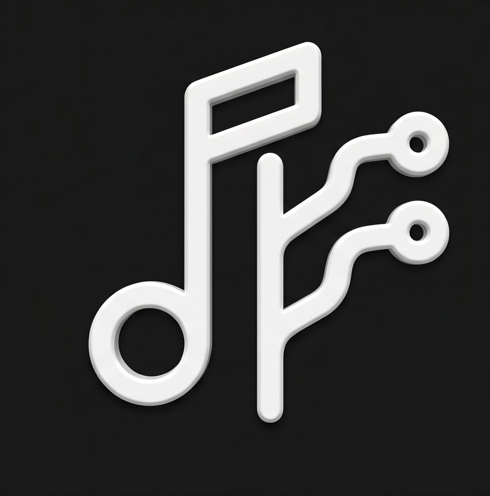

<div align="center">



# MusicGit

**Cross-Platform (Desktop Windows & Android) Multi-Provider Music Downloader, Player, Real-Time Synchronized Lyrics, and Git-Like Sync Engine**

Download playlists, albums, and tracks from **YouTube, Spotify, Deezer, Apple Music, and SoundCloud** into high-quality MP3 files with complete ID3v2 metadata, 1:1 square album artwork, automatic synchronized lyrics (.lrc), native Android lock screen and notification centre media controls, display wake lock, built-in desktop and mobile music player, real-time karaoke lyrics display (*Time-Synced LRC*), and intelligent playlist synchronization (*Git Pull for Music*).

[English](README.md) • [Bahasa Indonesia](README.id.md)

<br/>

[-0288d1?style=for-the-badge&logo=windows&logoColor=white)](https://github.com/naufalpratomo/yt-playlist-downloader/releases/latest)
[-3ddc84?style=for-the-badge&logo=android&logoColor=white)](https://github.com/naufalpratomo/yt-playlist-downloader/releases/latest)
[](https://naufalpratomo.my.id)

<br/>

[](https://youtube.com/)
[](https://spotify.com/)
[](https://deezer.com/)
[](https://music.apple.com/)
[](https://soundcloud.com/)
[](https://www.python.org/)
[](https://fastapi.tiangolo.com/)
[-3ddc84?style=flat-square&logo=android)](https://developer.android.com/)
[](https://pywebview.flowrl.com/)
[](https://github.com/yt-dlp/yt-dlp)
[](https://lrclib.net/)
[](LICENSE)

</div>

---

## MusicGit Philosophy & Concept

MusicGit treats your **Music Playlists** like a *Remote Repository* and your local music folder on PC or Android as the *Local Repository*:
- **Remote Mapping**: Each local playlist directory automatically stores the remote link in a `.musicgit.json` metadata file.
- **Git Pull / Sync Engine**: Compares the difference (*Diff*) between remote playlist tracks and your local storage. Click the **"Sync with YouTube"** button to download only newly added songs without re-downloading existing ones.
- **Universal Provider Parsing**: Paste links from YouTube, Spotify, Deezer, Apple Music, or SoundCloud. The system detects the provider automatically, extracts clean tracklists, and downloads audio with matching fidelity.
- **Built-in Music Player**: Listen to your entire music collection directly inside the application (Desktop & Mobile) without requiring third-party media players.
- **Real-Time Synchronized Lyrics**: Displays synchronized scrolling lyrics with automated active line highlighting and interactive *click-to-seek* (click any lyric line to instantly jump to that exact audio timestamp).
- **Cross-Platform Ready**: Enjoy a consistent experience across Windows PC and Android smartphones with local music storage synchronization (`Music/` directory).

---

## Key Features

### 1. Multi-Platform Support (Desktop Windows & Android APK)
- **Desktop (Windows)**: Lightweight native window powered by `pywebview` and local FastAPI server. Available as a Setup installer (`.exe`) and portable standalone archive (`.zip`).
- **Mobile (Android APK)**: Powered by an embedded Python runtime (`Chaquopy`) executing the FastAPI backend natively on your Android device. Python boots directly from `MainActivity` with error diagnostics and automatic server polling.
- **Android Media Playback & Notification Center**: Built-in Android Foreground Service with native `MediaSessionCompat` and `NotificationCompat.MediaStyle` controls (Previous, Play/Pause, Next, Seekbar, and Album Cover) on Android 13+ Notification Centre and Lock Screen.
- **Keep Screen Awake (Display Wake Lock)**: Configurable screen wake lock prevents the display from dimming or sleeping while music is actively playing.
- **100% SVG Vector System**: Zero Unicode emojis across the codebase and interface; all icons are rendered using crisp, scalable SVG paths.
- **Mobile Responsive UI**: Adaptive glassmorphism UI with *Bottom Navigation Bar*, *compact player bar*, and touch-optimized navigation for smartphone screens.
- **Pure Solid Dark Theme**: Sleek, distraction-free solid studio dark theme with high-contrast UI and brand identity.

### 2. Universal Multi-Provider Music & Playlist Downloader (v2.3)
- **Spotify**: Extracts playlists, albums, and tracks using embed-based Next.js JSON decoding. Retrieves clean titles, artists, track order, and high-resolution 640x640 album artwork without requiring Spotify developer API keys.
- **Deezer**: Deep integration with Deezer public REST API. Supports playlists, albums, and single tracks with ultra-crisp 1000x1000 lossless cover artwork.
- **Apple Music**: Direct catalog schema parsing for curated playlists and albums.
- **SoundCloud**: Direct set and track extraction powered by yt-dlp native extraction.
- **YouTube & YouTube Music**: Full playlist synchronization, individual tracks, and Shorts support.
- **Intelligent Audio Matcher**: Duration-weighted fuzzy matching algorithm pairs external platform tracks with the highest quality official audio streams on YouTube Music.
- **Clean Tag Preservation**: Original track titles, artists, album names, track numbers, and release dates are faithfully embedded into ID3v2 tags without YouTube video title noise.

### 3. Built-in Music Player & Real-Time LRC Lyrics (Karaoke Mode)
- Persistent audio player bar with full controls: *Play/Pause, Next, Previous, Shuffle, Repeat (All / One / Off), Timeline Seekbar, Volume Booster*.
- Time-synchronized LRC lyric stream panel with smooth auto-scrolling and active line highlighting.
- **Click-to-Seek**: Click on any lyric line to instantly seek and jump playback to that timestamp.
- Playback queue manager, full-screen immersive karaoke view, and desktop keyboard shortcuts (`Space`, `ArrowLeft/Right`, `ArrowUp/Down`).

### 4. Discord Rich Presence (Listening to MusicGit)
- **Live Status on Discord**: Automatically broadcasts your active music playback to your Discord Desktop profile ("Listening to MusicGit").
- **Rich Details**: Shows the active song title, artist ("by Artist"), album name, high-resolution album cover art, and a live progress seekbar with elapsed and remaining timestamps.
- **Pure Native IPC**: Connects directly to Discord Desktop via unbuffered Windows Named Pipes (`\\.\pipe\discord-ipc-0`) with zero external library overhead and non-blocking background queueing.
- **Configurable Settings**: Easily toggle Discord Rich Presence on or off in the Settings view.

### 5. Universal Playlist Synchronization (Git Pull for Music)
- Link local playlist directories to remote playlist URLs (**YouTube, Spotify, Deezer, Apple Music, or SoundCloud**).
- Automatically detect newly added tracks on the remote platform playlist.
- Visual diff comparison (*Local OK* vs *+ New*).
- 1-Click selective batch download for newly added songs via smart audio matcher.

### 6. High-Quality Audio Downloader & ID3v2 Metadata
- MP3 bitrate options: **192 kbps**, **256 kbps**, **320 kbps**, and **128 kbps**.
- Custom filename templates (`{num}. {title}-{id}.mp3`, `{artist} - {title}.mp3`, etc.).
- Automatically center-crops thumbnails into clean 1:1 square cover art.
- Embeds complete ID3v2 tags: Track Number (`TRCK`), Title (`TIT2`), Artist (`TPE1`), Album (`TALB`), Album Artist (`TPE2`), and Release Year (`TDRC`).
- Unifies playlist tracks under one coherent album for Windows Media Player, Apple Music, car head units, and Android music players.

### 7. Tag Manager & Repair Toolkit
- Inspect metadata health across your local music folders: detects missing artists (*Unknown Artist*), missing cover art, or missing lyric files.
- 1-Click mass repair tool to embed local `cover.jpg` artwork and auto-fetch missing `.lrc` lyrics from the LRCLIB database.

---

## Installation & Build Guide

### 1. Developer Setup (Source Code - Desktop)

```bash
# Clone the repository
git clone https://github.com/naufalpratomo/yt-playlist-downloader.git
cd yt-playlist-downloader

# Install Python dependencies
pip install -r requirements.txt
```

> **FFmpeg Requirement**: Ensure `ffmpeg.exe` is installed on your system PATH (`winget install Gyan.FFmpeg`) or placed directly in the project root directory.

**Run the Application:**
- **Option A (Windows Batch)**: Double-click `start.bat`.
- **Option B (Terminal)**:
  ```bash
  python run.py
  ```
- **Option C (Browser Dev Mode with Hot Reload)**:
  ```bash
  npm run dev:web
  # or double-click start_web.bat
  ```

---

### 2. Build Standalone Windows Executable (.exe)

To generate a standalone `.exe`, installer setup, and portable `.zip` archive:
```bash
# Double-click build_exe.bat or execute in CMD:
build_exe.bat
```
The compiled output will be generated in:
- Portable directory: `dist/MusicGit/MusicGit.exe`
- Standalone portable ZIP: `dist/MusicGit-v2.3-Windows.zip`
- Setup Installer (.exe): `dist/MusicGit-v2.3-Setup.exe` (via Inno Setup)

---

### 3. Build Android APK (.apk)

The Android app is built with Gradle and Chaquopy, bundling the Python backend and web frontend into a native APK.

**Prerequisites:**
- Java Development Kit (JDK 17+)
- Android SDK / Android Studio

**Build Instructions:**
- **Option A (Automated Script)**: Double-click `build_apk.bat`.
- **Option B (Terminal / Gradle)**:
  ```bash
  cd android
  ./gradlew assembleDebug
  ```

> The compiled debug APK will be located at:
> - `dist/MusicGit-v2.3-Android.apk`
> - `android/app/build/outputs/apk/debug/app-debug.apk`

---

## Project Structure

```
yt-playlist-downloader/
├── android/                  # Native Android project (Chaquopy + WebView)
│   ├── app/
│   │   ├── build.gradle      # Android dependencies & Chaquopy Python config
│   │   └── src/main/
│   │       ├── AndroidManifest.xml
│   │       ├── java/         # MainActivity, MediaSessionCompat & BackgroundService
│   │       ├── python/       # Embedded backend runner (android_server.py)
│   │       └── res/          # Launcher icons (mipmap), themes & XML configs
│   ├── build.gradle          # Root Gradle build script
│   └── gradlew.bat           # Gradle wrapper script
├── backend/
│   ├── __init__.py           # Python package marker
│   ├── app.py                # FastAPI server, REST endpoints & SSE streaming
│   ├── audio_matcher.py      # Cross-provider fuzzy audio search & duration matcher
│   ├── library_manager.py    # Music library scanner, .musicgit metadata & LRC parser
│   ├── cover_processor.py    # 1:1 center-cropping & artwork processing
│   ├── discord_rpc.py        # Discord Rich Presence manager via Windows Named Pipe IPC
│   ├── downloader.py         # Multi-provider download engine & playlist diff sync
│   ├── lyrics_fetcher.py     # LRCLIB API integration (plain & synced .lrc)
│   ├── metadata_tagger.py    # ID3v2 tagging & album unity writer
│   ├── providers/            # Multi-provider modules (Spotify, Apple Music, Deezer, SoundCloud, YouTube)
│   └── utils.py              # Cross-platform path helpers (Windows / Android)
├── frontend/
│   ├── assets/
│   │   ├── logo-darkmode-v2.jpg # Official MusicGit app logo
│   │   ├── logo-darkmode.jpg    # Dark mode asset
│   │   └── MusicGit-logo.png    # Fallback legacy logo
│   ├── app.js                # Audio player, Time-Synced LRC, theme manager & SSE stream
│   ├── index.html            # Desktop & mobile layout (Sidebar, Bottom Nav, Lyrics, Player)
│   └── style.css             # Solid dark studio UI & responsive mobile styles
├── public/image/             # Master branding assets (logo-darkmode-v2.jpg)
├── tests/                    # Unit tests (ID3 tagging, Library manager, API endpoints)
├── app_icon.ico              # Multi-resolution Windows icon (generated with curved corners)
├── build_apk.bat             # Automated script to build Android APK (.apk)
├── build_exe.bat             # Automated script to build Windows Executable (.exe & .zip)
├── fix_existing_tags.py      # CLI script for repairing local folder ID3 tags
├── installer.iss             # Inno Setup script for Windows installer
├── package.json              # Package config & scripts (dev:web, capacitor)
├── requirements.txt          # Python dependencies
├── run.py                    # Desktop app launcher (pywebview + local server)
├── start.bat                 # Quick launch script for desktop development
└── start_web.bat             # Quick launch script for browser dev mode (hot reload)
```

---

## Creator & License

Developed by **[Naufal Pratomo](https://naufalpratomo.my.id)**

Distributed under the MIT License. Feel free to use, study, and build upon this project.