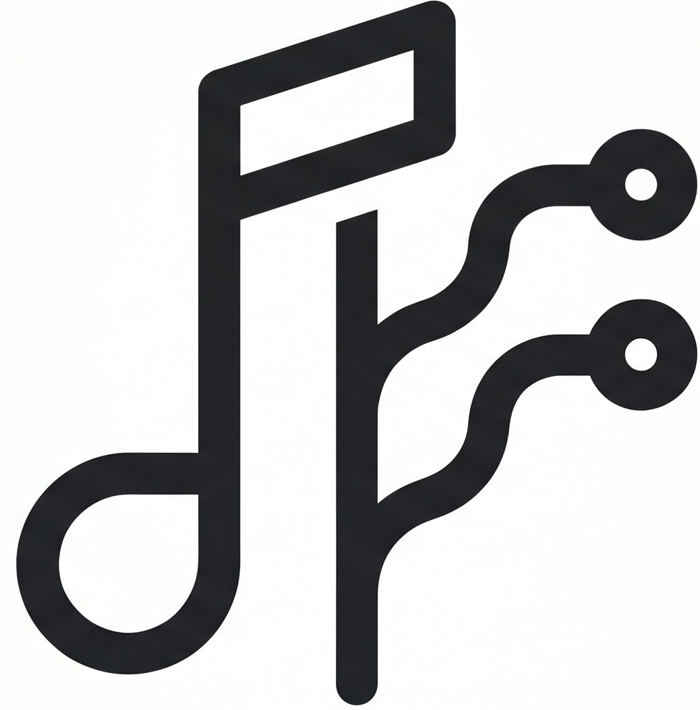

<div align="center">



# MusicGit

**Cross-Platform (Desktop & Android) Music Player, Real-Time Synchronized Lyrics, and YouTube Playlist Git-Like Sync Engine**

Download YouTube playlists or videos into high-quality MP3 files with complete ID3v2 metadata, 1:1 center-cropped album artwork, automatic synchronized lyrics (.lrc), built-in desktop & mobile music player, real-time karaoke lyrics display (*Time-Synced LRC*), intelligent playlist synchronization (*Git Pull for Music*), and full support for both **Desktop Windows (.exe)** and **Android Mobile (.apk)**.

[English](README.md) • [Bahasa Indonesia](README.id.md)

<br/>

[-0288d1?style=for-the-badge&logo=windows&logoColor=white)](https://github.com/naufalpratomo/yt-playlist-downloader/releases/latest)
[-3ddc84?style=for-the-badge&logo=android&logoColor=white)](https://github.com/naufalpratomo/yt-playlist-downloader/releases/latest)
[](https://naufalpratomo.my.id)

<br/>

[](https://www.python.org/)
[](https://fastapi.tiangolo.com/)
[-3ddc84?style=flat-square&logo=android)](https://developer.android.com/)
[](https://pywebview.flowrl.com/)
[](https://github.com/yt-dlp/yt-dlp)
[](https://lrclib.net/)
[](LICENSE)

</div>

---

## MusicGit Philosophy & Concept

MusicGit treats your **YouTube Playlist** like a *Remote Repository* and your local music folder on PC / Android as the *Local Repository*:
- **Remote Mapping**: Each local playlist directory automatically stores the remote YouTube link in a `.musicgit.json` metadata file.
- **Git Pull / Sync Engine**: Compares the difference (*Diff*) between the tracks on YouTube and your local storage. Click the **"Sync with YouTube"** button to download only newly added songs without re-downloading existing ones.
- **Built-in Music Player**: Listen to your entire music collection directly inside the application (Desktop & Mobile) without requiring third-party media players.
- **Real-Time Synchronized Lyrics**: Displays synchronized scrolling lyrics with automated active line highlighting and interactive *click-to-seek* (click any lyric line to instantly jump to that exact audio timestamp).
- **Cross-Platform Ready**: Enjoy a consistent experience across Windows PC and Android smartphones with local music storage synchronization (`Music/` directory).

---

## Key Features

### 1. Multi-Platform Support (Desktop Windows & Android APK)
- **Desktop (Windows)**: Lightweight native window powered by `pywebview` and local FastAPI server.
- **Mobile (Android APK)**: Powered by an embedded Python runtime (`Chaquopy`) executing the FastAPI backend natively on your Android device. Python boots directly from `MainActivity` with full error diagnostics and automatic server polling.
- **Background Media Playback (Android)**: Features an Android Foreground Service and system media notification so music keeps playing seamlessly when the screen is locked or while multitasking.
- **Mobile Responsive UI**: Adaptive glassmorphism UI with *Bottom Navigation Bar*, *compact player bar*, and touch-optimized navigation for smartphone screens.
- **Dark / Light Theme**: Full theme switching with dynamic logo swap (dark mode & light mode branding assets), persistent user preference via `localStorage`.

### 2. Built-in Music Player & Real-Time LRC Lyrics (Karaoke Mode)
- Persistent audio player bar with full controls: *Play/Pause, Next, Previous, Shuffle, Repeat (All / One / Off), Timeline Seekbar, Volume Booster*.
- Time-synchronized LRC lyric stream panel with smooth auto-scrolling and active line highlighting.
- **Click-to-Seek**: Click on any lyric line to instantly seek and jump playback to that timestamp.
- Playback queue manager, full-screen immersive karaoke view, and desktop keyboard shortcuts (`Space`, `ArrowLeft/Right`, `ArrowUp/Down`).

### 3. YouTube Playlist Synchronization (Git Pull for Music)
- Link local playlist directories to YouTube Playlist IDs / URLs.
- Automatically detect newly added tracks on YouTube.
- Visual diff comparison (*Local OK* vs *+ New*).
- 1-Click selective batch download for new tracks.

### 4. High-Quality Audio Downloader
- Supports both YouTube playlists and individual video URLs.
- MP3 bitrate options: **192 kbps**, **256 kbps**, **320 kbps**, and **128 kbps**.
- Custom filename templates (`{num}. {title}-{id}.mp3`, `{artist} - {title}.mp3`, etc.).
- Real-time download progress bar, network speed, estimated time remaining (ETA), and Server-Sent Events (SSE) activity log.

### 5. ID3v2 Metadata & Album Unity
- Automatically center-crops high-resolution YouTube thumbnails into clean 1:1 square cover art.
- Embeds complete ID3v2 tags: Track Number (`TRCK`), Title (`TIT2`), Artist (`TPE1`), Album (`TALB`), Album Artist (`TPE2`), and Release Year (`TDRC`).
- Unifies playlist tracks under one coherent album for Windows Media Player, Apple Music, car head units, and Android music players.

### 6. Tag Manager & Repair Toolkit
- Inspect metadata health across your local music folders: detects missing artists (*Unknown Artist*), missing cover art, or missing lyric files.
- 1-Click mass repair tool to embed local `cover.jpg` artwork and auto-fetch missing `.lrc` lyrics from the LRCLIB database.

---

## Installation & Build Guide

### 1. Developer Setup (Source Code - Desktop)

```bash
# Clone the repository
git clone https://github.com/naufalpratomo/yt-playlist-downloader.git
cd yt-playlist-downloader

# Install Python dependencies
pip install -r requirements.txt
```

> **FFmpeg Requirement**: Ensure `ffmpeg.exe` is installed on your system PATH (`winget install Gyan.FFmpeg`) or placed directly in the project root directory.

**Run the Application:**
- **Option A (Windows Batch)**: Double-click `start.bat`.
- **Option B (Terminal)**:
  ```bash
  python run.py
  ```
- **Option C (Browser Dev Mode with Hot Reload)**:
  ```bash
  npm run dev:web
  # or double-click start_web.bat
  ```

---

### 2. Build Standalone Windows Executable (.exe)

To generate a standalone `.exe` and portable `.zip` archive using PyInstaller:
```bash
# Double-click build_exe.bat or execute in CMD:
build_exe.bat
```
The compiled output will be generated in `dist/MusicGit.exe` and `dist/MusicGit-v2.2-Windows.zip`.

---

### 3. Build Android APK (.apk)

The Android app is built with Gradle and Chaquopy, bundling the Python backend and web frontend into a native APK.

**Prerequisites:**
- Java Development Kit (JDK 17+)
- Android SDK / Android Studio

**Build Instructions:**
- **Option A (Automated Script)**: Double-click `build_apk.bat`.
- **Option B (Terminal / Gradle)**:
  ```bash
  cd android
  ./gradlew assembleDebug
  ```

> The compiled debug APK will be located at:
> `android/app/build/outputs/apk/debug/app-debug.apk`

---

## Project Structure

```
yt-playlist-downloader/
├── android/                  # Native Android project (Chaquopy + WebView)
│   ├── app/
│   │   ├── build.gradle      # Android dependencies & Chaquopy Python config
│   │   └── src/main/
│   │       ├── AndroidManifest.xml
│   │       ├── java/         # MainActivity (direct Python boot) & BackgroundService
│   │       ├── python/       # Embedded backend runner (android_server.py)
│   │       └── res/          # Launcher icons (mipmap), themes & XML configs
│   ├── build.gradle          # Root Gradle build script
│   └── gradlew.bat           # Gradle wrapper script
├── backend/
│   ├── __init__.py           # Python package marker
│   ├── app.py                # FastAPI server, REST endpoints & SSE streaming
│   ├── library_manager.py    # Music library scanner, .musicgit metadata & LRC parser
│   ├── cover_processor.py    # 1:1 center-cropping & artwork processing
│   ├── downloader.py         # yt-dlp download engine & playlist diff sync
│   ├── lyrics_fetcher.py     # LRCLIB API integration (plain & synced .lrc)
│   ├── metadata_tagger.py    # ID3v2 tagging & album unity writer
│   └── utils.py              # Cross-platform path helpers (Windows / Android)
├── frontend/
│   ├── assets/
│   │   ├── logo-lightmode.jpg # Light mode logo & app icon
│   │   ├── logo-darkmode.jpg  # Dark mode logo
│   │   └── MusicGit-logo.png  # Fallback legacy logo
│   ├── app.js                # Audio player, Time-Synced LRC, theme manager & SSE stream
│   ├── index.html            # Desktop & mobile layout (Sidebar, Bottom Nav, Lyrics, Player)
│   └── style.css             # Dark navy glassmorphism UI & responsive mobile styles
├── public/image/             # Master branding assets (logo-lightmode.jpg, logo-darkmode.jpg)
├── tests/                    # Unit tests (ID3 tagging, Library manager, API endpoints)
├── app_icon.ico              # Multi-resolution Windows icon (generated from logo)
├── build_apk.bat             # Automated script to build Android APK (.apk)
├── build_exe.bat             # Automated script to build Windows Executable (.exe & .zip)
├── fix_existing_tags.py      # CLI script for repairing local folder ID3 tags
├── package.json              # Package config & scripts (dev:web, capacitor)
├── requirements.txt          # Python dependencies
├── run.py                    # Desktop app launcher (pywebview + local server)
├── start.bat                 # Quick launch script for desktop development
└── start_web.bat             # Quick launch script for browser dev mode (hot reload)
```

---

## Creator & License

Developed by **[Naufal Pratomo](https://naufalpratomo.my.id)**

Distributed under the MIT License. Feel free to use, study, and build upon this project.